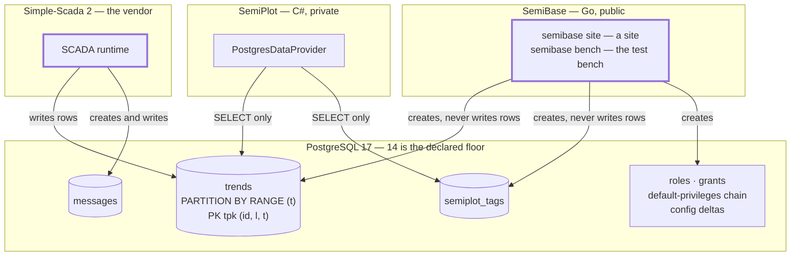
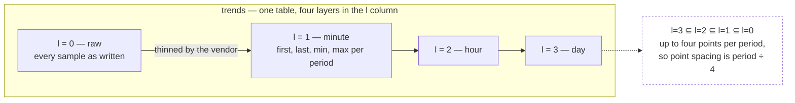
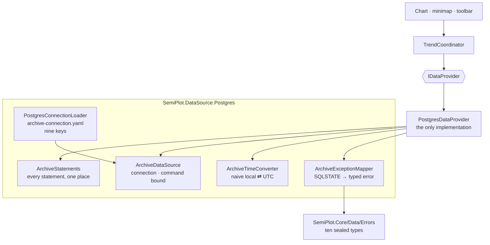
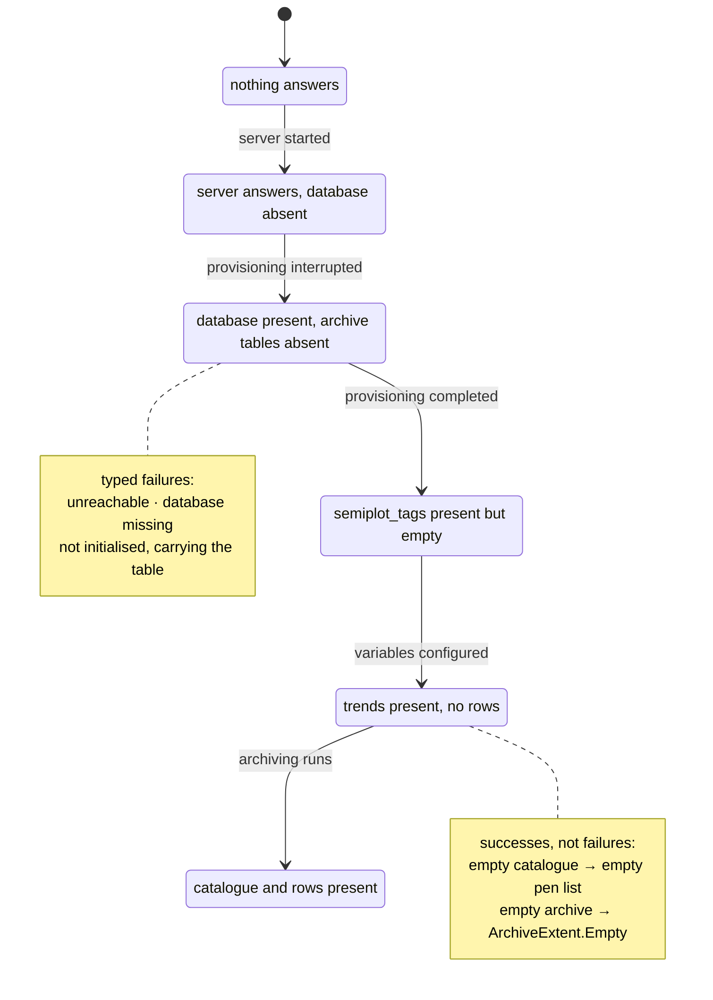
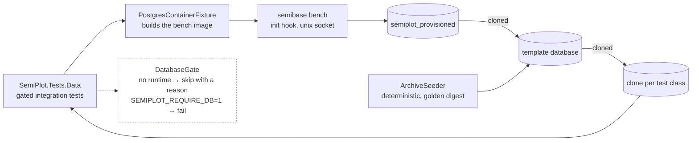

# The PostgreSQL topology, at a glance

Who owns what, who writes what, and what SemiPlot is allowed to touch. The authoritative text is in
`postgres-instance.md`, `scada-archive.md` and `data-integration.md`; this page is the map, not the
contract.

## Ownership and the write direction

Three parties touch one database and only one of them writes the archive.

`messages` is created by the SCADA and is not read by any shipped query. SemiPlot creates no object
inside the database and runs nothing there: no summary table, trigger, function, scheduled job or
extension. Any write, `ALTER` or `CREATE` it issues is a defect, and the server answers `42501`.

## What the archive holds

The vendor writes every sample once at `l = 0`, then copies a thinned selection into three coarser
layers. Nothing derives them at read time — they already exist.

Partitions are daily ranges over `t`, named `tpYYYYmMMdDD`, with `tpdefault` catching anything that
misses one. A non-empty `tpdefault` means a partition was missing at write time — a fault signal, not
a normal state.

The primary key is `(id, l, t)` and its leading column is `id`. Every query therefore carries the
variable list, or it cannot use the key and reads every partition instead.

## How SemiPlot reads it

The composition root resolves `PostgresDataProvider`, and there is nothing else to resolve: an
archive that does not answer opens an error window rather than falling back to invented data, which
`data-integration.md` states under **Startup**. `StartupFailureMapper` turns each public error type
into a title, a detail and a remedy — Core's ten plus the UI-local `StartupReadTimedOutError`,
eleven in all — and a reflection coverage test fails when one has no arm; two of them reach the
operator as a banner row over a working chart rather than as a window. Every member
of `IDataProvider` is implemented — the pen catalogue, the archive extent, the windowed history read
and the live-edge poll.

## The three provisioning states, and the fourth

A client can start at any point in provisioning, and every state below is normal rather than a crash.

`semibase site` creates `public.trends` and `semiplot_tags` in one run, so `NoTables` is not a
stage a site passes through — it is a provisioning that stopped part-way, or a table removed after
one. Both tables are absent for the same reason and both come back from the same command, so the
client reports whichever table the failing statement names and sends the operator to `semibase site`
either way.

The split matters and is settled: a **missing** `semiplot_tags` raises `42P01` and is a typed failure
carrying the table name, while an **empty** one is a successful read of zero rows. Both stay
distinguishable, which is what SemiBase requires — provisioning skipped versus commissioning
unfinished — and no error type exists for the empty case, because the database answered correctly and
nothing is broken.

## The bench

The same provisioner runs against a container, so a broken grant fails a test rather than
commissioning day. It arrives as a layer of the bench image and runs from the entrypoint's init
hook, before the published port opens, so nothing is resolved from the machine running the suite.

The provisioning creates `public.trends` empty; the seeder writes into it as `scada_writer`, the way
the SCADA writes its own, and adds only the day partitions its rows land in. Every read in the tests
connects as `semiplot_reader`. Nothing in this repository defines a table, a role or a grant.
