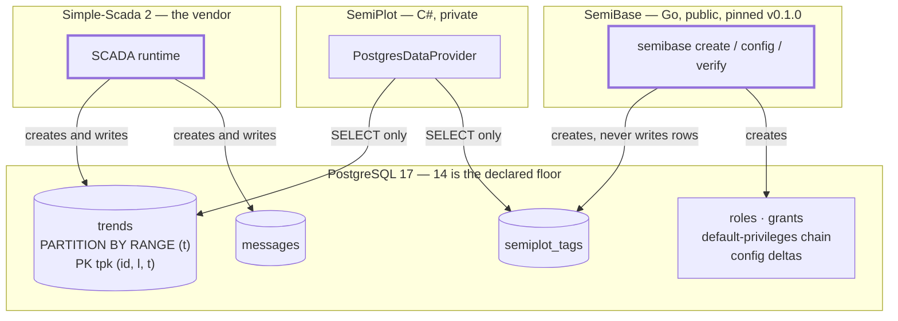
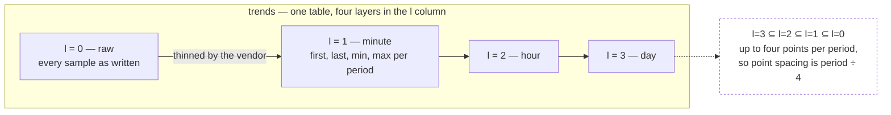
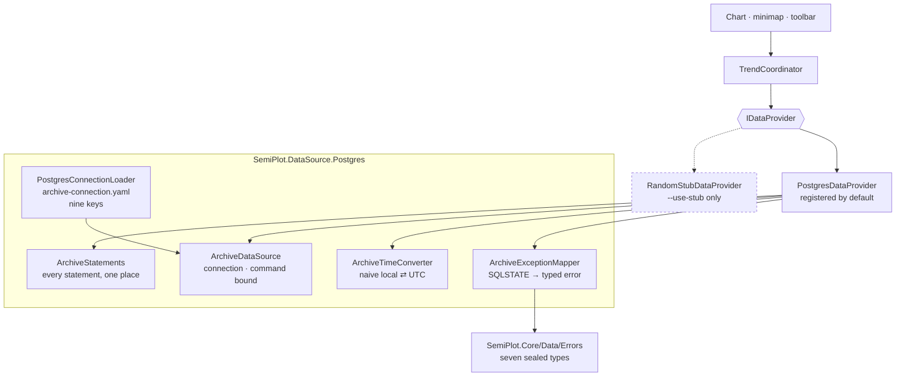
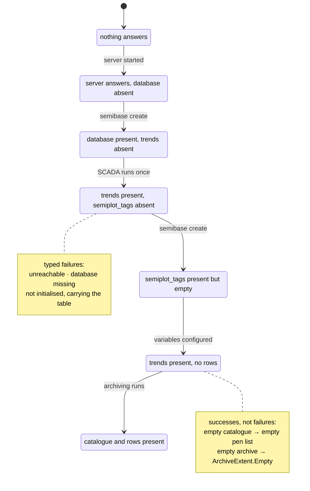
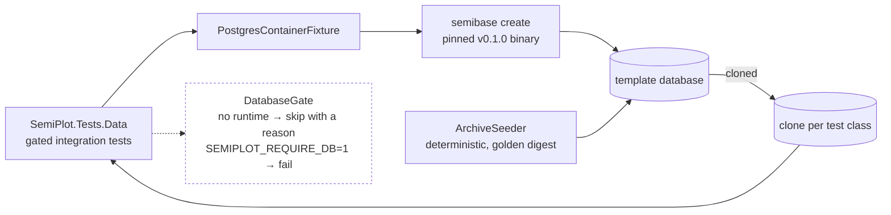

# The PostgreSQL topology, at a glance

Who owns what, who writes what, and what SemiPlot is allowed to touch. The authoritative text is in
`postgres-instance.md`, `scada-archive.md` and `data-integration.md`; this page is the map, not the
contract.

## Ownership and the write direction

Three parties touch one database and only one of them writes the archive.

`messages` is created by the SCADA and is not read by any shipped query. SemiPlot creates no object
inside the database and runs nothing there: no summary table, trigger, function, scheduled job or
extension. Any write, `ALTER` or `CREATE` it issues is a defect, and the server answers `42501`.

## What the archive holds

The vendor writes every sample once at `l = 0`, then copies a thinned selection into three coarser
layers. Nothing derives them at read time — they already exist.

Partitions are daily ranges over `t`, named `tpYYYYmMMdDD`, with `tpdefault` catching anything that
misses one. A non-empty `tpdefault` means a partition was missing at write time — a fault signal, not
a normal state.

The primary key is `(id, l, t)` and its leading column is `id`. Every query therefore carries the
variable list, or it cannot use the key and reads every partition instead.

## How SemiPlot reads it

The composition root resolves `PostgresDataProvider`. The stub is reachable only through
`--use-stub` and is never a fallback from a failed archive: an archive that does not answer opens an
error window, which `data-integration.md` states under **Startup**. Every one of the seven public
error types maps to a state in that window, and a reflection coverage test fails when one does not.
Three of the four provider members are implemented — the pen catalogue, the archive
extent and the windowed history read. `Subscribe` returns an empty sequence until
`postgres-realtime-poll` fills it.

## The four provisioning states, and the fifth

A client can start at any point in provisioning, and every state below is normal rather than a crash.

The split matters and is settled: a **missing** `semiplot_tags` raises `42P01` and is a typed failure
carrying the table name, while an **empty** one is a successful read of zero rows. Both stay
distinguishable, which is what SemiBase requires — provisioning skipped versus commissioning
unfinished — and no error type exists for the empty case, because the database answered correctly and
nothing is broken.

## The bench

The same provisioning path runs against a container, so a broken grant fails a test rather than
commissioning day.

The seeder writes as `scada_writer` and creates the archive tables the way the SCADA does; every read
in the tests connects as `semiplot_reader`. Nothing in this repository defines a role or a grant.
