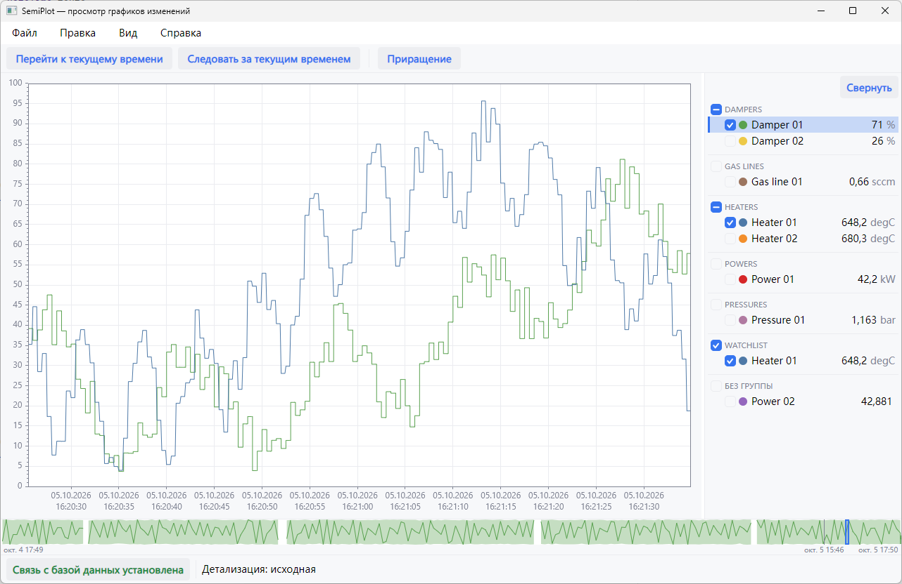
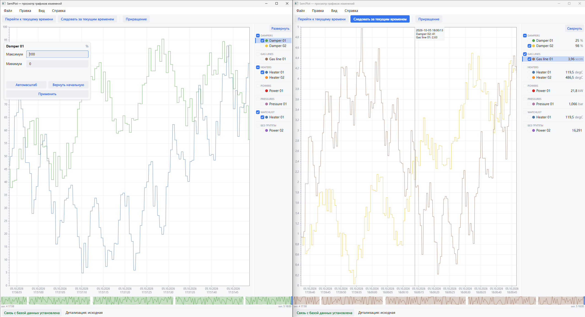
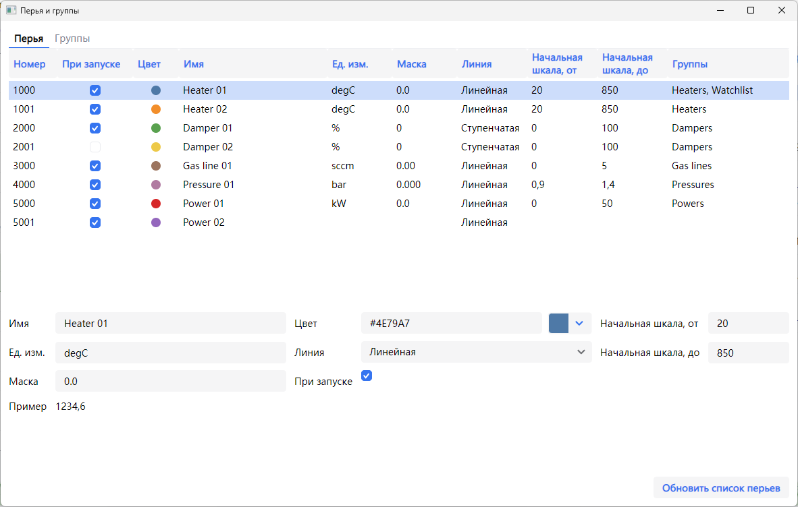
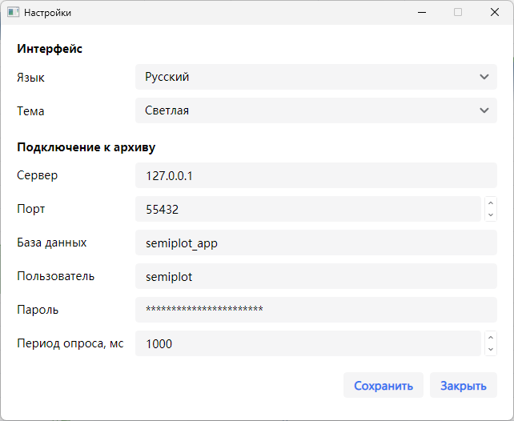

# SemiPlot

[](https://github.com/Semiteq/SemiPlot/actions/workflows/ci.yml)


<div align="center">
    
</div>

SemiPlot — программа просмотра трендов технологических параметров промышленных установок. Она читает
архив Simple-Scada 2 в СУБД PostgreSQL и отображает архивные данные и значения в реальном времени.

[Документация](./docs/architecture/README.md)

<div align="center">
    
    <p><em>Главное окно: график, условные обозначения по группам, миникарта архива</em></p>
</div>

<div align="center">
    
    <p><em>Два окна: у каждого свой набор перьев и свой интервал времени</em></p>
</div>

## Возможности

**Тренды**

- Отдельная шкала у каждого пера. На графике отображается ось активного пера; щелчок по оси открывает
  панель настройки шкалы.
- Курсор показывает значения всех видимых перьев в выбранной точке. Работа с маркерами.
- Изменение масштаба и сдвиг по времени, переход к текущему времени, режим «Следовать за текущим
  временем».
- Слой архива (исходные данные, минутный, часовой, суточный) выбирается автоматически для установленного масштаба, точки группируются и соединяются с учетом экстремумов.
- Миникарта показывает весь архив с графиком активного пера и время в точке под указателем мыши.

**Перья и группы**

- Условные обозначения сгруппированы; у каждого пера отображается текущее значение по его маске, у
  каждой группы — переключатель видимости всех её перьев.
- Окно «Правка → Перья и группы» задаёт имя, единицу измерения, маску, цвет, тип линии, начальную
  шкалу пера и состав групп.
- Изменения каталога перьев применяются во всех открытых окнах без перезапуска.
- Новые переменные Simple-Scada добавляются в каталог кнопкой «Обновить список перьев».

**Окна и настройки**

- Команда «Файл → Новое окно» запускает независимый экземпляр программы.
- Окно «Правка → Настройки» задаёт язык интерфейса, тему оформления и параметры подключения к архиву.
  Смена темы применяется во всех открытых окнах сразу.
- Панель сообщений собирает все ошибки чтения и записи.
- При ошибке запуска программа открывает окно ошибки, из которого доступны настройки и перезапуск.

<div align="center">
    
    <p><em>Окно перьев и групп</em></p>
</div>

<div align="center">
    
    <p><em>Окно настроек</em></p>
</div>

## Требования

| Компонент            | Требование                                                                                       |
| -------------------- | ------------------------------------------------------------------------------------------------ |
| Операционная система | Windows 10 или Windows 11, 64-разрядная                                                          |
| Источник данных      | Архив Simple-Scada 2 в PostgreSQL, установленный [SemiBase](https://github.com/Semiteq/SemiBase) |
| Конфигурация         | Каталог с разделами `app/` и `connection/`; образец — `ConfigFiles/`                             |

## Запуск

```powershell
.\SemiPlot.UI.exe --config-dir <каталог конфигурации> --log-file <каталог журнала>\semiplot.log --logging-level info
```

Пароль к архиву задаётся в окне «Правка → Настройки». Без пароля программа открывает окно ошибки
запуска, из которого доступны те же настройки.
